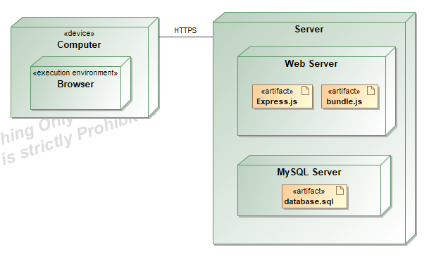

# Projektas „Sveikata“

# Sprendžiamo uždavinio aprašymas

## Sistemos paskirtis

Projekto tikslas – padėti žmogui sekti savo ir artimųjų sveikatą, remiantis kraujo tyrimais. Veikimo principas – platformą sudaro dvi dalys: internetinė aplikacija, kuria naudosis vartotojai, administratorius bei aplikacijų programavimo sąsaja (angl. trump. API). Žmogus, norėdamas naudotis šia platforma, turės prisiregistruoti prie internetinės aplikacijos. Prisiregistravęs vartotojas galės įvedinėti ir stebėti kraujo tyrimų duomenis, sekti savo ir artimųjų sveikatos parametrų pokyčius.

## Funkciniai reikalavimai

Neregistruotas sistemos vartotojas galės:

- Peržiūrėti platformos reprezentacinį puslapį;
- Peržiūrėti straipsnius;
- Prisiregistruoti prie internetinės aplikacijos.

Registruotas sistemos vartotojas galės:

- Sveikatos kortelės CRUD;
- Kraujo tyrimo CRUD;
- Kraujo tyrimo analitės CRUD.

Administratorius galės:

- Pašalinti vartotojo paskyrą;
- Redaktoriaus CRUD.

Redaktorius galės:

- Straipsnių CRUD.

# Pasirinktų technologijų aprašymas

- Kliento pusė (angl. Front-End) – SvelteKit karkasas;
- Serverio pusė (angl. Back-End) – Express.js karkasas;
- Duomenų bazė – MySQL;
- ORM - Prisma ORM.

# Sistemos architektūra

Sistemos diegimo diagrama

